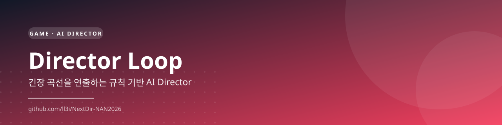
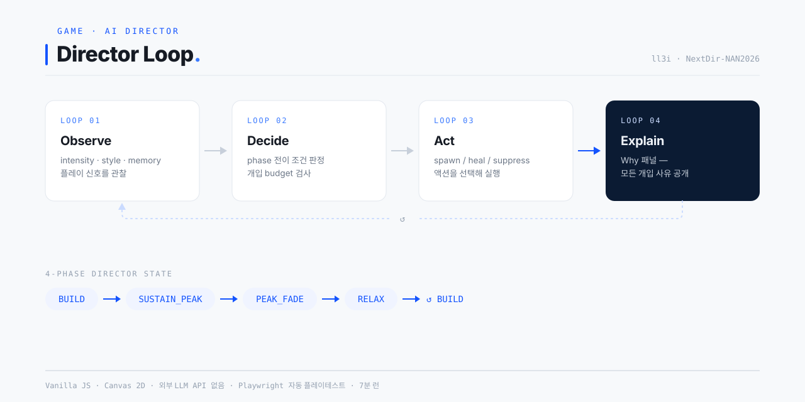
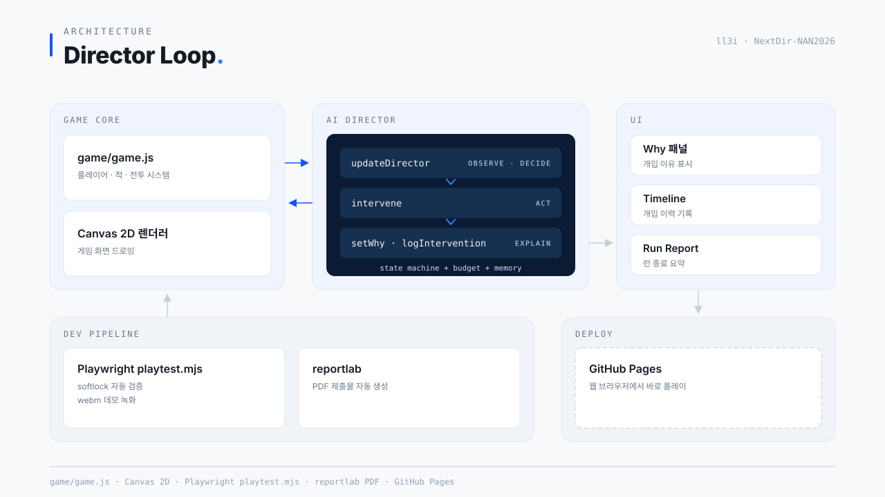
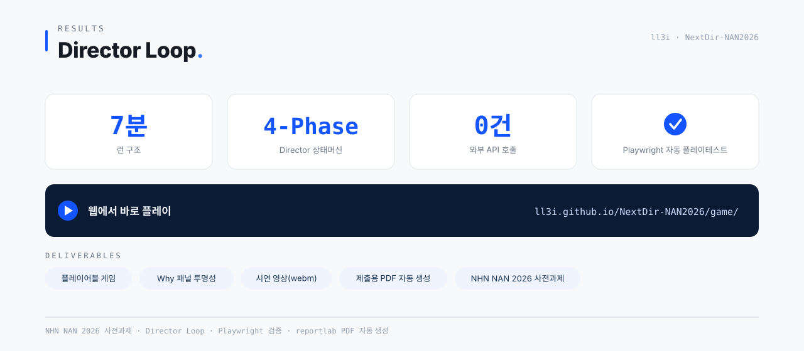
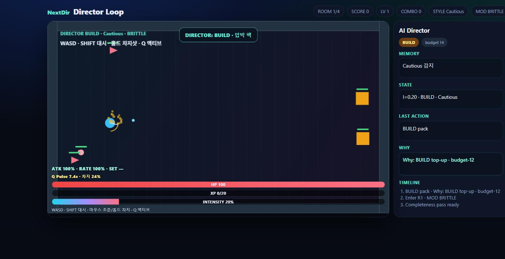
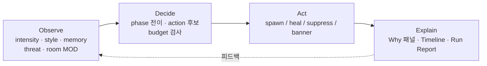
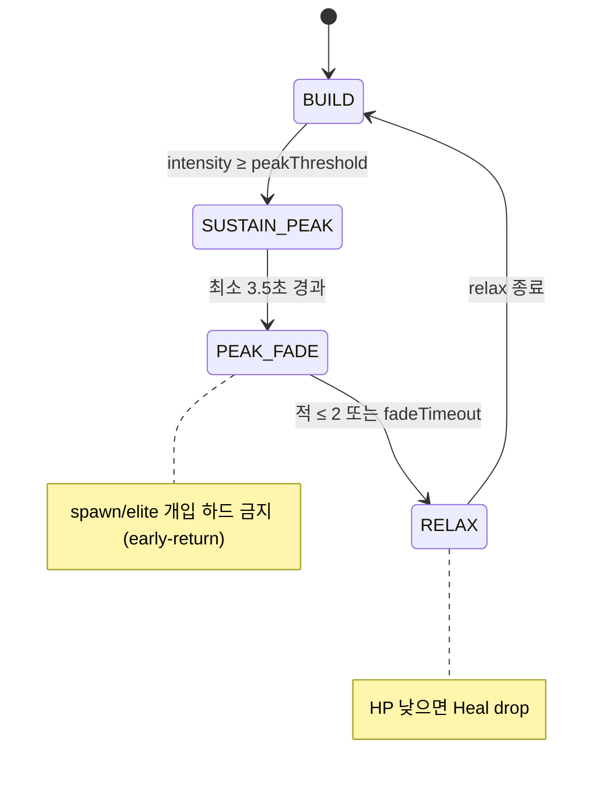

# Director Loop — NAN 2026 사전과제 (팀 NextDir)


**규칙 기반 AI Director가 실시간으로 긴장 곡선을 연출하는 탑다운 슈팅 로그라이크.**
Director는 플레이어의 상태·스타일·직전 방 결과를 관찰해 스폰/회복/억제를 결정하고,
모든 개입 사유를 **Why 패널**에 남겨 블랙박스가 되지 않게 합니다. 한 런 목표 6~8분.

- **팀:** NextDir (개인)
- **공식:** https://nan2026.nhn.com/
- **런타임 외부 LLM API 호출 없음** — 인게임 지능은 설명 가능한 상태머신 + budget + memory

## 한눈에 보기



### 시스템 아키텍처



### 주요 결과



## 미리보기

**🎮 브라우저에서 바로 플레이:** https://ll3i.github.io/NextDir-NAN2026/game/



## 실행 (Play)

1. `game/플레이하기.bat` 더블클릭 — 또는 `game/index.html`을 브라우저로 열기 (빌드 불필요)
2. 데모 자동재생: `game/index.html?demo=1`

### 조작

| 키 | 동작 |
|----|------|
| WASD | 이동 |
| SHIFT | 대시 |
| 마우스 | 조준 / 홀드 차지샷 |
| Q | 액티브 스킬 (세트에 따라 변화) |

## AI Director 설계 요약

한 프레임 루프는 **Observe → Decide → Act → Explain** 4단계입니다.
(구현: `game/game.js`의 `updateDirector` / `intervene` / `setWhy` / `logIntervention`)



Phase 상태머신은 L4D식 4단계로, Peak 뒤에 **반드시 호흡을 강제**합니다.



핵심 장치:

- **Intensity** — 적 threat·저체력·최근 피격·near-miss의 가중합을 부드럽게 추적
- **Style 분류** — Aggressive / Cautious / Mobile을 20초 슬라이딩 윈도우로 추정, 스폰 구성에 반영
- **Budget 경제** — 개입마다 비용 소모, "항상 최강 개입"을 구조적으로 차단
- **Memory → Why** — No-Hit·Heavy Damage·Fork 선택 등을 기억하고, 개입 사유를 문장으로 공개

상세 설계·프롬프트 활용 내역은 [`docs/02_AI활용기술문서.md`](docs/02_AI활용기술문서.md), 수치 스펙은 [`docs/design/core_loop.md`](docs/design/core_loop.md) 참고.

## 시연 영상

`demo/NextDir_DirectorLoop_Demo.webm` — `?demo=1` 자동 플레이를 Playwright로 녹화한 것입니다.

## 저장소 구조

```
game/      플레이 빌드 (index.html · game.js · style.css · 플레이하기.bat)
docs/      제출 문서 (소개서 · AI 기술문서 · 역할 기술서 · 시연 스크립트 · 설계)
demo/      시연 영상 (webm)
submit/    제출용 PDF · 통합 ZIP
tools/     playtest.mjs (Playwright 자동 플레이테스트) · record_demo.mjs · PDF/ZIP 빌더
```

### 개발 도구 (선택)

```bash
npm install          # Playwright (playtest / 데모 녹화용)
npm run demo         # tools/record_demo.mjs — 시연 webm 재생성
node tools/playtest.mjs   # Safe/Elite 풀런 봇 플레이테스트
```

## 제출물 매핑

| 항목 | 경로 |
|------|------|
| 플레이 빌드 | `game/index.html` · `game/플레이하기.bat` |
| 게임 소개서 | `docs/01_게임소개서.md` · `submit/pdf/01_게임소개서.pdf` |
| AI 활용 기술 문서 | `docs/02_AI활용기술문서.md` · `submit/pdf/02_AI활용기술문서.pdf` |
| 팀원 역할 기술서 | `docs/03_팀원역할기술서.md` · `submit/pdf/03_팀원역할기술서.pdf` |
| 시연 스크립트 | `docs/04_시연영상_스크립트.md` · `submit/pdf/…` |
| 시연 영상 | `demo/NextDir_DirectorLoop_Demo.webm` |

## 업로드

신청 페이지에 **`submit/NextDir_NAN2026_PreAssignment.zip`** 을 첨부하세요.
